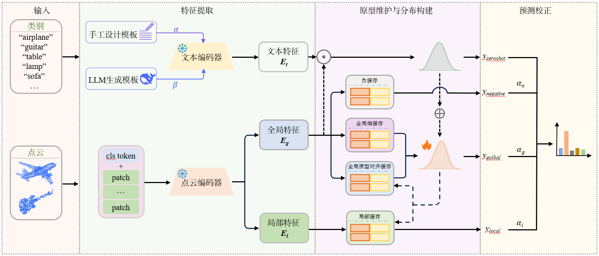

# DPC-Point

Distribution-Constrained Prototype Caching for Point Cloud Test-Time Adaptation



## 简介

DPC-Point 是一种面向三维视觉语言基础模型的训练无关测试时自适应方法。方法在推理阶段冻结基础模型，通过层级原型缓存、文本语义分布、在线视觉分布以及视觉-语义分布联合一致性评分，对连续到达的测试点云进行预测校准，从而缓解复杂分布偏移下的缓存污染问题。

当前正式复现代码支持三个骨干网络：

- ULIP
- OpenShape
- Uni3D

当前正式实验包含四个数据集：

- ModelNet
- ModelNet-C
- ScanObjectNN
- ScanObjectNN-C

三维视觉语言基础模型在点云测试数据发生分布偏移时，其视觉特征与类别语义之间的匹配关系易被破坏，导致零样本推理性能下降。为缓解该问题，测试时自适应方法通常利用连续到达的测试样本维护历史缓存，并以此校正预测结果。然而，大多数现有测试时自适应方法仅依赖于熵最小化来获得高置信度的预测，在复杂偏移场景下，一些错误高置信度样本容易进入缓存导致缓存污染。针对该问题，提出一种基于概率分布约束的原型缓存方法 DPC-Point。首先，设计了一种由多种缓存共同组成的层级缓存结构，用于构建具有代表性特征的可靠原型并存储不确定样本的混淆信息。然后，分别从文本语义和视觉特征出发，构建了文本语义分布和在线视觉分布两个互补的高斯分布，其中，文本语义分布由人工设计的类别模板和大语言模型生成的类别补充描述构建，用于为分布偏移下的零样本点云分类提供稳定的语义类别先验；在线视觉分布由层级缓存中被接纳的历史点云原型构建，用于记录测试流中不同类别特征的整体分布及其变化，为识别更可靠的点云原型提供视觉层面的依据。在此基础上，根据这两个分布设计了一个由视觉-语义分布一致性评分约束的原型缓存更新算法，用于和预测熵共同参与层级缓存的更新，使视觉-语义分布所反映的类别整体信息与可靠原型缓存所保留的历史特征共同参与后续样本的预测校正，从而减少缓存污染并提升复杂偏移下模型的整体性能。在多个数据集的实验结果表明，DPC-Point 能够有效提升多种三维视觉语言基础模型在几何扰动与真实扫描分布偏移条件下的零样本推理性能，验证了所提方法的有效性和鲁棒性。

## 复现步骤

以下命令默认在项目根目录执行。

完整复现的推荐顺序如下：

```bash
conda env create -f environment.yml
conda activate dpcp

bash scripts/download/download_data_all.sh

python weights/download_openshape_weights.py --variant vitg14
python weights/download_uni3d_weights.py --with-task-ckpts

# ULIP 权重需要从 README 中给出的官方链接下载，并放到 weights/ulip/ 默认路径。

bash scripts/zero_shot/run_all.sh 0
bash scripts/dpc_point/run_all.sh 0
```

### 1. 安装环境

推荐直接使用完整 Conda 环境文件：

```bash
conda env create -f environment.yml
conda activate dpcp
```

如果已经有兼容的 Python、CUDA 和 PyTorch 环境，也可以只安装 pip 依赖：

```bash
conda create -n dpcp python=3.9 -y
conda activate dpcp
pip install -r requirements.txt
```

实验环境主要版本如下：

- Python 3.9
- PyTorch 1.12.0
- CUDA 11.6
- torchvision 0.13.0
- timm 0.9.16
- open-clip-torch 2.24.0

### 2. 准备数据集

DPC-Point 只使用 ModelNet、ModelNet-C、ScanObjectNN 和 ScanObjectNN-C。干净数据集与扰动数据集放在同一个目录中：ModelNet 使用 `data/modelnet_c/clean.h5`，ScanObjectNN 使用 `data/sonn_c/hardest/clean.h5`。

官方下载地址和本仓库脚本如下：

| 数据集 | 官方链接 | 下载脚本 |
| --- | --- | --- |
| ModelNet / ModelNet-C | [Point-PRC modelnet_c](https://huggingface.co/datasets/auniquesun/Point-PRC/tree/main/new-3ddg-benchmarks/xset/corruption/modelnet_c) | `python scripts/download/download_data_modelnet_c.py` |
| ScanObjectNN / ScanObjectNN-C | [Point-PRC sonn_c](https://huggingface.co/datasets/auniquesun/Point-PRC/tree/main/new-3ddg-benchmarks/xset/corruption/sonn_c) | `python scripts/download/download_data_scanobjectnn_c.py` |

一键下载正式实验所需数据：

```bash
bash scripts/download/download_data_all.sh
```

脚本默认使用 Hugging Face 镜像：

```bash
https://hf-mirror.com
```

如果需要使用 Hugging Face 官方站点：

```bash
HF_ENDPOINT=https://huggingface.co bash scripts/download/download_data_all.sh
```

也可以分别下载：

```bash
python scripts/download/download_data_modelnet.py
python scripts/download/download_data_modelnet_c.py
python scripts/download/download_data_scanobjectnn.py
python scripts/download/download_data_scanobjectnn_c.py
```

下载完成后，数据目录应满足：

```text
DPC-Point/
  data/
    modelnet_c/
      shape_names.txt
      clean.h5
      add_global_0.h5
      add_global_1.h5
      ...
      scale_4.h5
    sonn_c/
      shape_names.txt
      hardest/
        clean.h5
        add_global_0.h5
        add_global_1.h5
        ...
        scale_4.h5
```

ModelNet-C 和 ScanObjectNN-C 均包含 7 类扰动：`add_global`、`add_local`、`dropout_global`、`dropout_local`、`jitter`、`rotate`、`scale`。`all35` 表示 7 类扰动乘以 5 个扰动等级。

### 3. 准备预训练权重

所有权重都放在项目根目录下的 `weights/` 中。默认路径如下：

| 骨干网络 | 官方链接 | 默认文件 |
| --- | --- | --- |
| ULIP | [Point-PRC ULIP weights](https://huggingface.co/datasets/auniquesun/Point-PRC/tree/main/pretrained-weights/ulip) | `weights/ulip/slip_base_100ep.pt`, `weights/ulip/pointbert_ulip1.pt` |
| OpenShape | [OpenShape pointbert-vitg14-rgb](https://huggingface.co/OpenShape/openshape-pointbert-vitg14-rgb), [CLIP ViT-bigG-14](https://huggingface.co/laion/CLIP-ViT-bigG-14-laion2B-39B-b160k) | `weights/openshape/open_clip_pytorch_model/vit-bigG-14/laion2b_s39b_b160k.bin`, `weights/openshape/openshape-pointbert-vitg14-rgb/model.pt` |
| Uni3D | [BAAI Uni3D](https://huggingface.co/BAAI/Uni3D/tree/main/modelzoo/uni3d-g), [EVA02 text encoder](https://huggingface.co/timm/eva02_enormous_patch14_plus_clip_224.laion2b_s9b_b144k) | `weights/uni3d/open_clip_pytorch_model/laion2b_s9b_b144k.bin`, `weights/uni3d/modelnet40/model.pt`, `weights/uni3d/scanobjnn/model.pt` |

OpenShape 和 Uni3D 可直接使用仓库脚本下载：

```bash
python weights/download_openshape_weights.py --variant vitg14
python weights/download_uni3d_weights.py --with-task-ckpts
```

ULIP 目前需要从上表链接下载后放到默认路径。最终目录示例：

```text
DPC-Point/
  weights/
    ulip/
      slip_base_100ep.pt
      pointbert_ulip1.pt
    openshape/
      open_clip_pytorch_model/
        vit-bigG-14/
          laion2b_s39b_b160k.bin
      openshape-pointbert-vitg14-rgb/
        model.pt
    uni3d/
      open_clip_pytorch_model/
        laion2b_s9b_b144k.bin
      modelnet40/
        model.pt
      scanobjnn/
        model.pt
```

### 4. 准备文本模板和可选 LLM 配置

正式代码将文本模板放在：

```text
text_templates/
  handcrafted/
    original_handcrafted.json
    pointcloud_depth_view.json
  llm_supplement/
    modelnet_c_deepseek_deepseek-v4-pro_multiview_2d3d_10_prompts.json
    sonn_c_deepseek_deepseek-v4-pro_multiview_2d3d_10_prompts.json
```

默认推理使用手工模板和 LLM 生成描述的融合文本特征。如果上述 LLM 描述 JSON 已经存在，复现实验不需要 API key。

只有在需要重新生成 LLM 描述时，才需要在项目根目录创建 `.env`：

```text
API_KEY=sk-xxx
BASE_URL=https://api.deepseek.com
MODEL=deepseek-v4-pro
PROVIDER=deepseek
TEMPERATURE=0.3
```

代码通过 `python-dotenv` 读取 `.env`。`API_KEY` 不会写入实验配置文件。

### 5. 运行 zero-shot 基线

运行单个骨干网络和单个数据集：

```bash
bash scripts/zero_shot/run_common.sh ulip modelnet_c 0 --severities 2
```

顺序运行一个骨干网络在四个数据集上的 zero-shot 结果：

```bash
bash scripts/zero_shot/run_ulip.sh 0
bash scripts/zero_shot/run_openshape.sh 0
bash scripts/zero_shot/run_uni3d.sh 0
```

顺序运行三个骨干网络在四个数据集上的 zero-shot 结果：

```bash
bash scripts/zero_shot/run_all.sh 0
```

其中 `0` 表示 GPU 编号。使用 CPU 时可写成：

```bash
bash scripts/zero_shot/run_common.sh ulip modelnet cpu
```

### 6. 运行 DPC-Point

运行单个骨干网络和单个数据集：

```bash
bash scripts/dpc_point/run_common.sh uni3d scanobjectnn_c 0 --severity-set s2
```

运行单个骨干网络在四个数据集上的 DPC-Point 结果：

```bash
bash scripts/dpc_point/run_ulip.sh 0
bash scripts/dpc_point/run_openshape.sh 0
bash scripts/dpc_point/run_uni3d.sh 0
```

完整复现三个骨干网络在四个数据集上的 DPC-Point 结果：

```bash
bash scripts/dpc_point/run_all.sh 0
```

扰动数据集的常用设置：

```bash
# 只跑 severity=2
bash scripts/dpc_point/run_common.sh uni3d modelnet_c 0 --severity-set s2

# 跑 7 类扰动 x 5 个等级
bash scripts/dpc_point/run_common.sh uni3d modelnet_c 0 --severity-set all35

# 只跑某几个扰动
bash scripts/dpc_point/run_common.sh uni3d scanobjectnn_c 0 --severity-set s2 --corruptions rotate,add_global
```

`scripts/dpc_point/run_*.sh` 会自动设置正式实验使用的数据集列表和推理配置。固定超参数会完整写入每次实验的 `config.json`，屏幕输出只保留当前实验身份、实时进度和 OA 结果。

## 输出文件

zero-shot 结果保存到：

```text
results/zero_shot/<experiment_name>/
```

DPC-Point 结果保存到：

```text
results/dpc_point/<experiment_name>/
```

DPC-Point 每个实验目录包含：

- `run.log`: 屏幕输出的完整日志
- `summary.csv`: 每个数据集任务的 OA 结果
- `config.json`: 本次实验的完整配置，包括数据集、骨干网络、文本模板、缓存容量、分布参数和最终得分权重

屏幕进度示例：

```text
DPC-Point formal inference
run_dir: results/dpc_point/uni3d_scanobjectnn_c_hardest_s2
backbone: uni3d
dataset: scanobjectnn_c
severity_set: s2
tasks: 7
------------------------------------------------------------
Running task: ScanObjectNN-C rotate_2
[cache] dataset=scanobjectnn_c, corruption=rotate_2, batch=1/2882, OA=37.50
[cache] dataset=scanobjectnn_c, corruption=rotate_2, batch=144/2882, OA=42.36
[infer] dataset=scanobjectnn_c, corruption=rotate_2, batch=144/2882, OA=48.61
Final OA: 50.21
Result: dataset=ScanObjectNN-C, corruption=rotate_2, OA=50.21
```

## 项目结构

```text
DPC-Point/
  assets/                 方法架构图
  configs/                数据集和模型配置
  datasets/               数据集读取和类别名称
  models/                 ULIP、OpenShape、Uni3D 模型定义
  runners/
    zero_shot.py          zero-shot 推理入口
    dpc_point/            DPC-Point 推理、缓存、分布和任务定义
  scripts/
    download/             数据集下载脚本
    zero_shot/            zero-shot 运行脚本
    dpc_point/            DPC-Point 运行脚本
  text_templates/         手工模板和 LLM 描述
  utils/                  公共配置、模型加载、指标和下载工具
  weights/                权重下载脚本和本地权重文件
```

## 致谢

本仓库的复现组织和评测协议参考了 [Point-Cache](https://github.com/auniquesun/Point-Cache)。同时感谢 ULIP、OpenShape、Uni3D、OpenCLIP、CLIP 和 Dassl 等开源项目。
